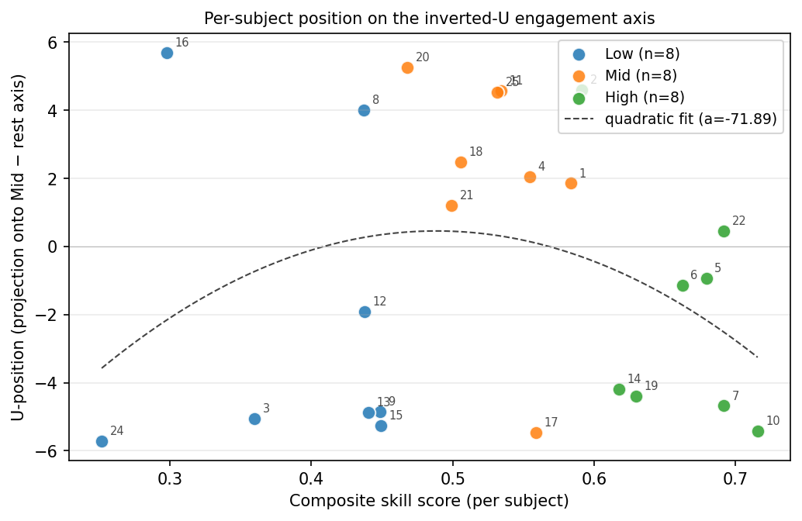

# Surgical Skill Manifold: ViT Training, Cross-Dataset Geometry, and the FLS Inverted-U

This repository contains the code and analyses on objective surgical-skill assessment from neural and
behavioral signals. Three lines of work sit alongside each other:

1. **A Vision Transformer model** that watches surgical video from the JIGSAWS
   dataset and jointly predicts robot kinematics, gesture labels, and skill
   level, with optional EEG/Eye RDM-based neural alignment.
2. **A cross-dataset Gromov–Wasserstein analysis** that asks whether JIGSAWS
   (real bench-top dVRK) and the NIBIB-RPCCC RAS simulator organize surgical
   skill into compatible geometries.
3. **The capstone scientific contribution: an EEG-based inverted-U cognitive
   engagement signature** in laparoscopic-surgery (FLS) trainees, with a
   methodologically-matched comparison to three prior surgical-skill studies
   (Nemani 2018 fNIRS, Soangra 2022 EMG, Lim 2025 EEG). Mid-skill subjects
   occupy a distinct high-engagement cortical state from both novices and
   experts, producing 79.2% Mid-vs-not-Mid binary classification accuracy at
   N = 24. The result is preliminary data for a CLIP-HBA-MEG personalized
   brain-aligned modeling grant.

For deep architecture, configs, dataset disambiguation, and pipeline internals,
see [`CLAUDE.md`](CLAUDE.md). 

---

## Capstone: the FLS inverted-U

The headline analysis lives in [`pipeline/skill_manifold_fls_ushape.py`](pipeline/skill_manifold_fls_ushape.py)
and runs five tests on the residualized, per-subject z-scored 40-d EEG feature
vector: per-feature Mid-vs-rest t-tests against four pre-registered Lim et al.
(2025) cognitive-load features, continuous-skill linear-vs-quadratic regression,
per-subject U-position projection onto the Mid – (Low ∪ High) discriminant axis,
a Nemani et al. (2018) anatomical topomap convergence check, and a four-classifier
3-class comparison (LDA, top-5 by t-stat LDA, PCA-5 LDA, and Random Forest with
in-fold RFE-5 mirroring Soangra et al. (2022)). A `--modality gaze` flag runs the
same analyses on the simultaneously-recorded Tobii eye-tracking features as a
modality-specificity control.



*Each subject is projected onto the Mid – (Low ∪ High) discriminant axis and
plotted against composite skill score. Mid subjects (mean U-position +2.06)
sit far above both Low (-2.25) and High (-1.96), showing the inverted-U
geometry at the per-subject level. The continuous U-position is the
individual-level quantity a personalized brain-aligned model could be trained
to track during longitudinal training.*

```bash
export PYTHONPATH=src
python pipeline/skill_manifold_fls_ushape.py --features_cache cache/skill_manifold_fls
python pipeline/skill_manifold_fls_ushape.py --features_cache cache/skill_manifold_fls --modality gaze
```

Outputs land under [`reports/skill_manifold_fls/`](reports/skill_manifold_fls/):
the markdown summary, JSON results, all plots, and the LaTeX grant prelim.

A supporting calibrated-bootstrap power analysis (synthetic effect-size sweep
that defends the cross-dataset bootstrap stability claim) lives in
[`pipeline/bootstrap_power_analysis.py`](pipeline/bootstrap_power_analysis.py).

---

## Requirements

- Python 3.11+
- `pip install -r requirements.txt` installs pinned versions. Default PyPI
  wheels are CPU-only; for an NVIDIA GPU, reinstall the CUDA-enabled torch
  build (see header comment in [`requirements.txt`](requirements.txt)).
- All Python entrypoints assume `PYTHONPATH=src`.

```bash
python -m venv .venv && source .venv/bin/activate
pip install -r requirements.txt
export PYTHONPATH=src
```

---

## Repository layout

| Directory | Purpose |
|-----------|---------|
| `src/` | Library code (models, training, eeg-eye bridge, skill-manifold modules) |
| `pipeline/` | Entrypoints (training drivers, GW orchestrator, FLS U-shape, power analysis) |
| `tests/` | Pytest suites for each major module |
| `reports/` | Analysis outputs and grant prelim writeup |
| `cache/` | Trial-level feature caches for the skill-manifold pipelines |
| `data/`, `EEG/`, `Eye/`, `Gestures/` | Raw datasets (large, not committed) |
| `checkpoints/` | Trained model weights |

The capstone-related files are concentrated in
[`pipeline/skill_manifold_fls_ushape.py`](pipeline/skill_manifold_fls_ushape.py),
[`src/skill_manifold/features_fls_eeg.py`](src/skill_manifold/features_fls_eeg.py),
[`src/skill_manifold/features_fls_gaze.py`](src/skill_manifold/features_fls_gaze.py),
and [`reports/skill_manifold_fls/`](reports/skill_manifold_fls/).

---

## Common entrypoints

**Generate LOUO splits and train one fold:**

```bash
python pipeline/generate_splits.py
python src/training/train_vit_system.py \
  --config src/configs/baseline.yaml --data_root . \
  --task Knot_Tying --split fold_1 \
  --output_dir checkpoints/knot_fold1
```

**Full 8-fold LOUO (Unix shell):**

```bash
./run_8fold_louo.sh                          # all tasks, baseline
./run_8fold_louo.sh all 1 8 src/configs/brain_eye.yaml
```

**EEG–Eye Bridge (Phase 1 → 2 → 3 → optional Phase 4):**

```bash
python pipeline/run_full_pipeline.py
python pipeline/run_full_pipeline.py --phase1-synthetic --skip-train   # smoke
```

**Cross-dataset Gromov–Wasserstein (JIGSAWS ↔ RAS simulator):**

```bash
python pipeline/skill_manifold_gw.py
python pipeline/skill_manifold_gw.py --smoke
```

**FLS within-dataset cross-modality GW (EEG ↔ gaze on the same subjects):**

```bash
python pipeline/skill_manifold_gw_fls.py --features_cache cache/skill_manifold_fls
```

For configs, brain modes, hyperparameter sweeps, and ablations, see
[`CLAUDE.md`](CLAUDE.md).

---

## Tests

```bash
export PYTHONPATH=src
python -m pytest tests/skill_manifold -v
python -m pytest tests/eeg_eye_bridge -v
```

---

## Citation

```bibtex
@software{surgical_gestures,
  title  = {ViT-Based Surgical Gesture Recognition and the FLS Inverted-U},
  author = {Michael Haidar, Mai Bui, Aaron Liu},
  year   = {2026},
  url    = {https://github.com/Mhaidar117/Surgical_Gestures}
}
```

Datasets used in this work: **JIGSAWS** (Gao et al., MICCAI M2CAI 2014),
**NIBIB-RPCCC-RAS** (Shafiei et al., PhysioNet 2023), and **NIBIB-RPCCC-FLS**
(PhysioNet, eeg-eye-gaze-for-fls-tasks v1.0.0). Full citation details live in
the grant prelim bibliography.

## License

See [LICENSE](LICENSE) if present.
